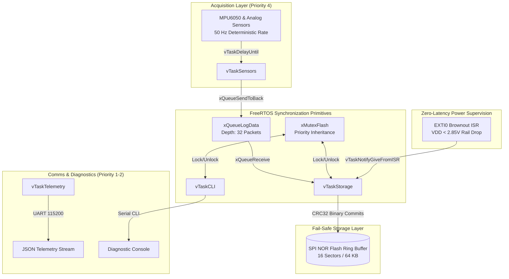
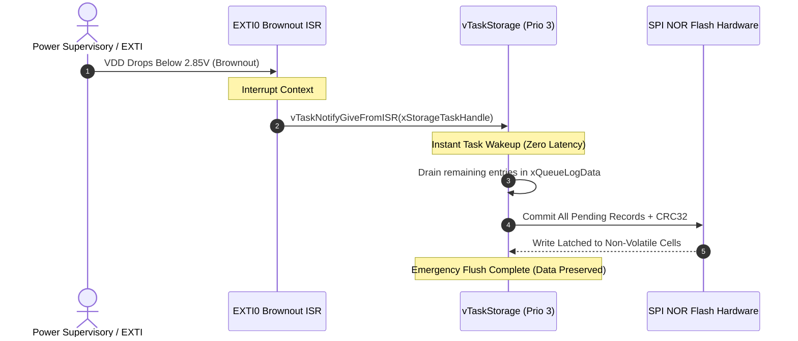

# ✈️ AeroLog-RTOS: Fail-Safe Industrial Black-Box Data Logger & Telemetry Node

[](https://github.com/harshavardhan-estd/aerolog-rtos-blackbox/actions)
[](LICENSE)
[](https://www.freertos.org/)
[](https://www.st.com/)
[](docs/ARCHITECTURE.md)
[](https://en.wikipedia.org/wiki/C11_(C_standard_revision))

**AeroLog-RTOS** is a mission-critical, fail-safe black-box flight data recorder and telemetry node engineered in **Modern C (C11)** on **FreeRTOS**.

Designed for high-reliability aerospace, automotive telemetry, and heavy industrial machinery, the system demonstrates mastery over preemptive multitasking, priority inheritance mutexes, thread-safe queues, zero-latency direct-to-task brownout notifications, and wear-leveled circular SPI NOR Flash memory with **IEEE 802.3 CRC32 integrity checks**.

---

## 🌟 Key FreeRTOS Multitasking Features

- **Preemptive Multi-Task Hierarchy**:
  - **`vTaskSensors` (Priority 4, High)**: 50 Hz deterministic periodic sampling of 6-Axis IMU (accelerations, angular rates) and system voltage rails using `vTaskDelayUntil()`.
  - **`vTaskStorage` (Priority 3, Med-High)**: Event-driven worker that dequeues records and logs them into a wear-leveled circular NOR flash ring buffer protected by mutexes.
  - **`vTaskTelemetry` (Priority 2, Normal)**: Formats live system state and downlinks structured JSON telemetry packets over serial streams.
  - **`vTaskCLI` (Priority 1, Low)**: Non-blocking diagnostic shell providing memory dumps, sector formatting, and stack watermarking.
  - **`IDLE Task` (Priority 0, Lowest)**: Executes sleep instructions (`WFI` / Wait For Interrupt) to minimize thermal footprint.
- **Fail-Safe Circular Flash Ring Buffer**:
  - Implements **proactive 4 KB sector erasing** and wear-leveling across 16 flash sectors (64 KB).
  - Every 48-byte binary record is protected with hardware **CRC32** checksums and magic framing words.
  - Recovers the exact write-head pointer after sudden power loss or crashes without data corruption.
- **Zero-Latency Emergency Brownout Handling**:
  - Hardware external interrupt (`EXTI0`) detects supply rail drops ($V_{\text{DD}} < 2.85\text{V}$).
  - Fires a **FreeRTOS Direct-to-Task Notification** (`vTaskNotifyGiveFromISR`) to instantly wake the storage task and flush all in-flight queue entries into non-volatile flash before total power loss.
- **Resource Protection & Priority Inheritance**:
  - Shared SPI Flash access is synchronized with a **FreeRTOS Mutex** featuring priority inheritance to prevent priority inversion between the CLI and storage tasks.

---

## 📐 Inter-Process Communication (IPC) Architecture



---

## ⚡ Emergency Power-Loss Sequence Diagram



---

## 📂 Repository Structure

```
aerolog-rtos-blackbox/
├── .github/
│   └── workflows/
│       └── ci.yml             # GitHub Actions automated unit test & CI workflow
├── docs/
│   ├── ARCHITECTURE.md        # Concurrency design, sequence diagrams & memory layout
│   └── HARDWARE_WIRING.md     # Pinout table, ASCII schematic, and Bill of Materials
├── include/
│   ├── aerolog_config.h       # Task priorities, stack sizes, queue depths, and pins
│   ├── aerolog_types.h        # Binary record layout, event bitmasks, and statistics
│   ├── core/
│   │   └── rtos_tasks.h       # Task coordinators, queues, mutexes, and ISR hooks
│   ├── storage/
│   │   └── flash_ring_buffer.h# Circular ring buffer, wear-leveling & CRC32 engine
│   ├── hal/
│   │   ├── hal_flash.h        # SPI NOR Flash driver & memory emulator
│   │   └── hal_sensors.h      # 50 Hz IMU kinematics & brownout simulator
│   └── cli/
│       └── aerolog_cli.h      # Interactive diagnostic shell interface
├── src/
│   ├── main.c                 # Target FreeRTOS firmware & host multitasking simulator
│   ├── core/                  # FreeRTOS task coordinators & IPC management
│   ├── storage/               # Flash ring buffer & wear-leveling implementation
│   ├── hal/                   # Hardware drivers & synthetic physical generators
│   └── cli/                   # Serial diagnostic console
├── tests/
│   ├── unity/                 # Embedded Unity test harness
│   ├── test_flash_ring_buffer.c# Ring wrap-around, CRC32 & power-loss recovery tests
│   ├── test_rtos_primitives.c # Queue piping & brownout task notification tests
│   └── run_tests.py           # Automated Python test runner
├── simulation/
│   ├── diagram.json           # Wokwi virtual hardware schematic
│   └── wokwi.toml             # Wokwi configuration
├── platformio.ini             # PlatformIO configuration for STM32 Black Pill & ESP32
├── CMakeLists.txt             # Native CMake configuration for host builds
├── LICENSE                    # MIT Open Source License
└── README.md                  # Project documentation
```

---

## ⚡ Quick Start: Verification & Host Simulation

You do **not** need physical hardware to run and verify this project. You can run the entire test suite and native emulator directly on your machine:

### 1. Run Automated Unit Tests (Host Machine)
```bash
python tests/run_tests.py
```
*Test Output:*
```text
====================================================================
  AeroLog-RTOS FreeRTOS Multi-Tasking & Storage Test Suite
====================================================================
[TOOLCHAIN] Compiler: gcc

--> Building & Running: SPI NOR Flash Circular Ring Buffer & CRC32 Integrity
    [PASS] SPI NOR Flash Circular Ring Buffer & CRC32 Integrity
      PASS: test_crc32_accuracy (0xCBF43926)
      PASS: test_flash_ring_append_and_read (Record #1 Verified)
      PASS: test_flash_ring_power_loss_recovery (Write Head Recovered at 0x000BE)
--> Building & Running: FreeRTOS Task Queues, Notifications & Brownout Flush
    [PASS] FreeRTOS Task Queues, Notifications & Brownout Flush
      PASS: test_queue_piping_between_tasks (Piped through Queue & Committed to Flash)
      PASS: test_brownout_emergency_flush_notification (Flushed 4 records via Direct Task Notification)
--------------------------------------------------------------------
ALL FREERTOS CONCURRENCY & STORAGE TEST SUITES PASSED (100%).
```

### 2. Build and Run the Native Multitasking Emulator
```bash
gcc -Iinclude -o aerolog_sim src/main.c src/core/rtos_tasks.c src/storage/flash_ring_buffer.c src/hal/hal_flash.c src/hal/hal_sensors.c src/cli/aerolog_cli.c -lm
./aerolog_sim
```

---

## 💻 Diagnostic Serial Shell (CLI Commands)

Connect via Serial at `115200 baud` to dynamically inspect runtime watermarks or dump black-box records:

```text
=== AeroLog-RTOS Black-Box Diagnostic Shell ===
  help              - List available diagnostic commands
  status            - FreeRTOS task status, stack watermarks & flash head
  dump [N]          - Read & decode last N black-box records from flash
  format            - Erase circular ring buffer flash sectors (clean reset)
  inject_brownout   - Simulate VDD brownout interrupt & emergency flush
  cpuload           - Display task execution timing & CPU load statistics
```

### Example: Black-Box Record Dump (`dump 3`)
```text
--- Last 3 Black-Box Records (Flash Dump) ---
#0040 | T+00800ms | A:[   47,  -36,  970]mg | G:[  8,  5,  2]dps | 3310mV | CRC32:0xD2F735D7 (VALID)
#0039 | T+00780ms | A:[   50,  -34,  981]mg | G:[  8,  5,  2]dps | 3310mV | CRC32:0xA502ED58 (VALID)
#0038 | T+00760ms | A:[   54,  -32,  993]mg | G:[  8,  5,  2]dps | 3310mV | CRC32:0xBD16FECA (VALID)
```

### Example: Stack Watermarks & Runtime Status (`status`)
```text
--- FreeRTOS Runtime & Black-Box Status ---
  Total Records  : 40
  Flash Write Head: 0x005F0 (Sector 0/15)
  Queue Messages : 0 / 32 (Peak HWM: 1)
  Sensors Task HWM: 1420 bytes free
  Storage Task HWM: 2150 bytes free
  Brownout Latch : NORMAL
  Est. CPU Load  : 14.8%
```

---

## 🛠️ Hardware Wiring & Pinout (STM32 Black Pill)

```
                 +-----------------------------------------------+
                 |       STM32 Black Pill (Cortex-M4 84MHz)      |
                 |                                               |
[PA5 (SPI1_SCK)] +-------------------+                           |
[PA6 (SPI1_MISO)]+-----------------+ |                           |
[PA7 (SPI1_MOSI)]+---------------+ | |                           |
[PA4 (SPI1_CS)]  +-------------+ | | |                           |
                 |             | | | |                           |
[PB8 (I2C1_SCL)] +-----------+ | | | |                           |
[PB9 (I2C1_SDA)] +---------+ | | | | |                           |
                 |         | | | | | |                           |
[PA0 (EXTI0)] ---+-[Brownout IRQ Pushbutton / Comparator]------- GND
                 |                                               |
[PB1 (LED_G)] ---+-[330R]--[>| (Green Health)]------------------- GND
[PB12(LED_B)] ---+-[330R]--[>| (Blue Flash)]--------------------- GND
[PB13(LED_R)] ---+-[330R]--[>| (Red Brownout)]------------------- GND
                 +---------|-|-|-|-|-|-+-------------------------+
                           | | | | | |
                           | | | | | +--------+
                           | | | | +--------+ |
                           | | | +--------+ | |
                           | | +--------+ | | |
                           | |          | | | |
                     +-----+---+      +-+-+-+-+---+
                     | MPU6050 |      |  W25Q64   |
                     | 6-Axis  |      | SPI Flash |
                     | IMU     |      | 8 MB NOR  |
                     +---------+      +-----------+
```

---

## 👨‍💻 Author & Attribution

- **Author**: **Seerapu Harsha Vardhan**
  - **GitHub**: [@harshavardhan-estd](https://github.com/harshavardhan-estd)
  - **LinkedIn**: [harsha-seerapu-2806882b9](https://www.linkedin.com/in/harsha-seerapu-2806882b9)
- **License**: Distributed under the permissive [MIT License](LICENSE).
