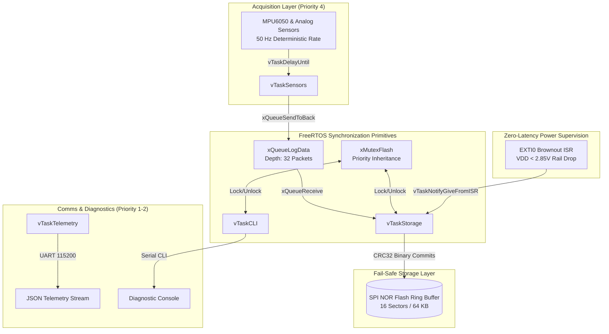
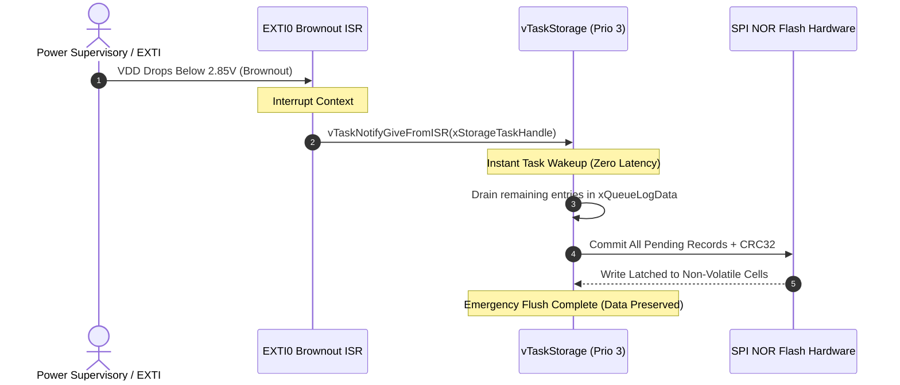

# AeroLog-RTOS Architecture & Real-Time Engineering Specification

**AeroLog-RTOS** is a mission-critical, fail-safe black-box flight data recorder and telemetry node engineered in **Modern C (C11)** on **FreeRTOS**. It demonstrates deterministic multitasking, real-time synchronization, priority inheritance, fail-safe circular flash storage, and zero-latency interrupt handling.

---

## 1. FreeRTOS Task Concurrency & Priority Hierarchy

| Task Name | Priority | Rate / Period | Stack Size | Role & Responsibilities |
| :--- | :--- | :--- | :--- | :--- |
| **`vTaskSensors`** | **`4` (High)** | **50 Hz (20 ms)** | 2048 Words | Highest priority application task. Periodically samples 6-Axis IMU (accelerations, angular rates) and supervisory voltages. Dispatches records into storage IPC queue using `vTaskDelayUntil()`. |
| **`vTaskStorage`** | **`3` (Med-High)** | **Event-Driven** | 3072 Words | Dequeues incoming sensor payloads, acquires the SPI Flash mutex, commits records to a circular NOR flash ring buffer, and handles sector wear-leveling and proactive sector erasing. |
| **`vTaskTelemetry`**| **`2` (Normal)** | **10 Hz (100 ms)** | 2048 Words | Streams structured JSON/Binary telemetry packets over UART for telemetry downlinks. |
| **`vTaskCLI`** | **`1` (Low)** | **Asynchronous** | 2048 Words | Low-priority background diagnostic shell for engineering inspection (`dump`, `status`, `format`). |
| **`IDLE Task`** | **`0` (Lowest)** | **Continuous** | 512 Words | FreeRTOS default idle task; invokes sleep mode (`WFI` / Wait For Interrupt) to minimize power draw. |

---

## 2. Inter-Process Communication (IPC) Architecture



---

## 3. Emergency Power-Loss Sequence Diagram

When the main supply rail dips below 2.85V, the hardware brownout supervisory circuit triggers an external interrupt (`EXTI0`). Using **FreeRTOS Direct-to-Task Notifications**, the storage task is unblocked instantly to flush all in-flight RAM data before power is lost completely:



---

## 4. Circular Flash Ring Buffer & Wear-Leveling Algorithm

The black-box journal operates over a dedicated region of **16 sectors (64 KB total)**:

```
+-----------------------------------------------------------------------+
| Sector 0  | Sector 1  | Sector 2  | ... | Sector 14 | Sector 15       |
| (4 KB)    | (4 KB)    | (4 KB)    |     | (4 KB)    | (4 KB)          |
+-----------------------------------------------------------------------+
0x00000     0x01000     0x02000                       0x0F000    0x0FFFF
```

### Key Principles:
1. **Zero Dynamic Allocation**: Fixed-size 48-byte records (`log_record_t`) written sequentially.
2. **Proactive Sector Erasing**: Whenever the write head pointer crosses a sector boundary (`addr % 4096 == 0`), the upcoming 4 KB sector is erased before writing, eliminating erase-latency pauses mid-flight.
3. **Circular Wrap-Around**: When the write head reaches `0x10000`, it cleanly wraps back to `0x00000`, creating an infinite rolling black-box log.
4. **Sudden Reboot Recovery**: On boot, `flash_ring_init()` scans magic headers and CRC32 checksums to immediately recover the exact write head position from the previous flight session.
